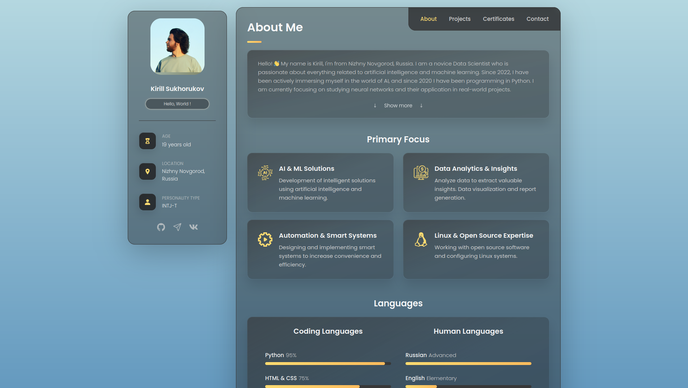

    

<h1 align="center">My Portfolio</h1>

Welcome to my portfolio! This website is a collection of my projects, achievements, and skills. Here you will find information about my work, certificates, and the technologies I work with.

<h2 align="center">Project Structure</h2>
<ul>
    <li><strong><code>index.html</code></strong> - The main page of the portfolio.</li>
    <li><strong><code>assets/</code></strong> - Folder with resources:
        <ul>
            <li><strong><code>css/</code></strong> - Styles for the website.</li>
            <li><strong><code>images/</code></strong> - Images used on the website:
                <ul>
                    <li><strong><code>avatar.jpg</code></strong> - My photo.</li>
                    <li><strong><code>certificates/</code></strong> - Certificates and awards.</li>
                    <li><strong><code>projects/</code></strong> - Screenshots and images of my projects.</li>
                    <li><strong><code>socials/</code></strong> - Social media icons.</li>
                </ul>
            </li>
            <li><strong><code>js/</code></strong> - JavaScript files for website interactivity.</li>
        </ul>
    </li>
    <li><strong><code>privacy-policy/</code></strong> - Privacy policy for the "Snowman Run" project.</li>
    <li><strong><code>Preview.png</code></strong> - Website preview.</li>
    <li><strong><code>README.md</code></strong> - This file.</li>
</ul>

<h2 align="center">Technologies</h2>

The following technologies are used in this project:

<ul>
    <li><strong>HTML</strong> - for website structure.</li>
    <li><strong>CSS</strong> - for styling.</li>
    <li><strong>JavaScript</strong> - for interactive elements.</li>
</ul>

<h2 align="center">Contacts</h2>

Contact me via:

<ul>
    <li><a href="https://t.me/k1rsn7">Telegram</a></li>
</ul>